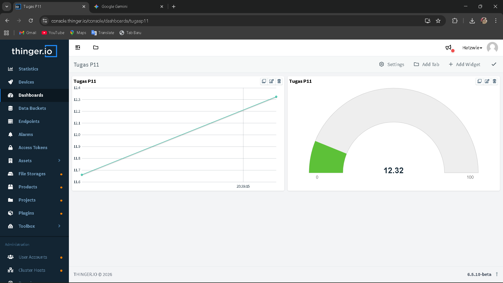

# 📡 Monitoring Jarak Sensor HC-SR04 - Thinger.io

Tugas Pertemuan 11 - Mata Kuliah Sistem Tertanam (Kelompok 13)

## 👥 Anggota Kelompok
* [Muhamad Hata]
* [Subhan Alief Putra Firdaus]
* [Mohammad Ihsan Nurdin]

## 🛠️ Deskripsi Proyek
Proyek ini menggunakan sensor ultrasonik **HC-SR04** untuk mengukur jarak secara real-time. Data dikirimkan dari mikrokontroler (ESP32/ESP8266) menuju platform IoT **Thinger.io** melalui koneksi WiFi.

## 📊 Hasil Visualisasi Dashboard
Berikut adalah tampilan monitoring pada dashboard Thinger.io yang telah dikonfigurasi menggunakan widget *Time Series Chart* dan *Radial Gauge*:

## 🔧 Komponen yang Digunakan
* **Sensor:** HC-SR04 (Ultrasonik)
* **Mikrokontroler:** ESP32 / NodeMCU
* **Platform:** Thinger.io Cloud Console
* **Kabel:** Jumper Wires

## 🔌 Konfigurasi Pin
* **VCC** -> 5V / VIN
* **GND** -> GND
* **Trig** -> GPIO 5
* **Echo** -> GPIO 18

## 🚀 Cara Penggunaan
1.  Pastikan library `Thinger.io` sudah terinstal di Arduino IDE.
2.  Buka file `.ino` (program utama) dan sesuaikan `USERNAME`, `DEVICE_ID`, dan `DEVICE_CREDENTIAL`.
3.  Upload kode ke perangkat.
4.  Buka Dashboard Thinger.io untuk melihat data real-time.
